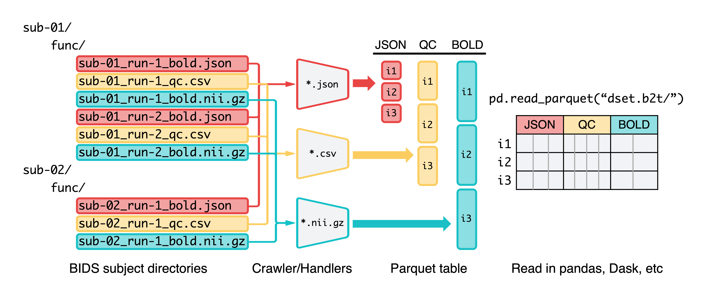

# bids2table

[](https://github.com/clane9/bids2table/actions/workflows/ci.yaml?query=branch%3Amain)
[](https://codecov.io/gh/clane9/bids2table)
[](https://github.com/psf/black)
[](LICENSE)

bids2table is a scalable data pipeline for transforming a structured directory of scientific data files (e.g. a [BIDS](https://bids-specification.readthedocs.io/en/stable/) directory) into a [Parquet](https://parquet.apache.org/) database. The goal is to help researchers connect their specialized scientific data to the broader data science ecosystem.

- [Installation](#installation)
- [Getting started](#getting-started)
- [Architecture](#architecture)
- [What is Parquet?](#what-is-parquet)
- [Scope](#scope)
- [Contributing](#contributing)

## Installation

A pre-release version can be installed with

```
pip install git+https://github.com/clane9/bids2table
```

## Getting started

The interface to bids2table is a command-line program `bids2table`.

```
usage: bids2table [-h] --config NAME [--overrides-yaml PATH] [--print-only]
                  [KEY=VALUE [KEY=VALUE ...]]

positional arguments:
  KEY=VALUE             list of config overrides

optional arguments:
  -h, --help            show this help message and exit
  --config NAME, -c NAME
                        name of or path to config file
  --overrides-yaml PATH, -y PATH
                        path to YAML file containing a list of overrides
  --print-only, -p      only print composed config and exit
```

[This example](examples/openneuro-derivatives-mriqc/) demonstrates the basic usage of bids2table by walking through how to transform [MRIQC](https://mriqc.readthedocs.io/en/latest/) outputs for all the [OpenNeuro](https://openneuro.org/) datasets available at [OpenNeuroDerivatives](https://github.com/OpenNeuroDerivatives).

Full documentation is coming. In the meantime, the entry points for understanding the source code are:

- [`bids2table.launch()`](bids2table/engine.py): the main data pipeline engine.
- [`bids2table.config.Config`](bids2table/config/base.py): a [Hydra structured config](https://hydra.cc/docs/tutorials/structured_config/intro/) defining all the config options accepted by `bids2table.launch()`.
- [`bids2table.crawler.Crawler`](bids2table/crawler.py): a class implementing the core directory crawling logic.

## Architecture



1. A collection of data directories are partitioned into batches (`sub-01/`, `sub-02`).
2. Each batch is processed in parallel by a `Crawler`, which maps file names to matching `Handler`s.
3. Each `Handler` processes its stream of files into records (shaded vertical boxes), which are inserted into a Parquet table at an assigned column block.
4. The row index for a record (`i1`, `i2`, `i3`) is generated by an `Indexer`. For BIDS data, the index is composed of BIDS fields like "subject" and "session" extracted from the file name.

The end result of the pipeline is one or more directories of Parquet files (`dset.b2t/`), which can be read transparently as a typical dataframe across many popular data science tools.

## What is Parquet?

Parquet is an efficient and widely supported binary tabular format optimized for large-scale data analysis. Some of the key features of Parquet are:

- Its column-oriented, compressible, splittable data layout are [ideal for efficient storage and retrieval](https://www.databricks.com/glossary/what-is-parquet).

  | Dataset | Size on Amazon S3 | Query Run Time | Data Scanned | Cost |
  |---|---|---|---|---|
  | Data stored as CSV files | 1 TB | 236 seconds | 1.15 TB | $5.75 |
  | Data stored in Apache Parquet Format | 130 GB | 6.78 seconds | 2.51 GB | $0.01 |
  | Savings | 87% less when using Parquet | 34x faster | 99% less data scanned | 99.7% savings |

- It has a [flexible type system](https://arrow.apache.org/docs/python/data.html) supporting primitive types as well as complex structured data:

  - **Basic types**: numbers, booleans, date and times.
  - **Variable-length types**: string, binary "BLOBs".
  - **Nested types**: list, struct.

  In addition, bids2table adds support for [several extension types](https://arrow.apache.org/docs/python/extending_types.html#defining-extension-types-user-defined-types)

  - [**ndarray**](bids2table/extensions/ndarray.py): n-dimensional arrays.
  - [**pickle**](bids2table/extensions/pickle.py): arbitrary objects serialized with [pickle](https://docs.python.org/3/library/pickle.html).

- It's broadly supported across the data science community:

  ```python
  # pandas
  df = pd.read_parquet("table.parquet")

  # Dask
  df = dask.dataframe.read_parquet("table.parquet")

  # Spark
  df = spark.read.parquet("table.parquet")

  # DuckDB
  df = duckdb.from_parquet("table.parquet")
  ```

## Scope

bids2table is built primarily for the neuroimaging community. It supports common neuroimaging data formats and directory structures out of the box. However, it's designed with extensibility in mind. Support for new kinds of data can be easily added through lightweight APIs and a simple plugin system.

## Contributing

We welcome any and all feedback and contributions! A contributing guide is coming. In the meantime, please feel free to submit any questions, comments, or suggestions in our [Issue tracker](https://github.com/clane9/bids2table/issues).

If you're interested in contributing as a developer, we would be glad to have your help! Feel free to open an Issue thread or reach out directly.
