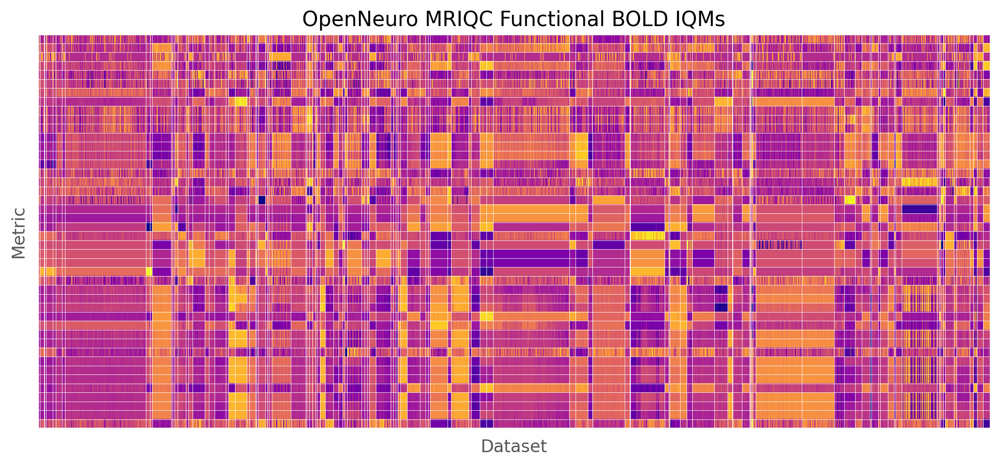

# Organizing all OpenNeuro MRIQC results using bids2table

[MRIQC](https://github.com/nipreps/mriqc) outputs are available for a lot of the [OpenNeuro](https://openneuro.org/) datasets at [OpenNeuroDerivatives](https://github.com/OpenNeuroDerivatives).

In this example, we'll organize all the MRIQC anatomical and functional image quality metrics into a parquet database.

## Downloading datasets

To download the OpenNeuro MRIQC datasets, run

```sh
datalad install https://github.com/OpenNeuroDerivatives/OpenNeuroDerivatives.git
cd OpenNeuroDerivatives
for d in ds*-mriqc; do
  datalad install $d
done
```

By default, datalad does not fetch all the data files up front. To get all the json data we need, we can run

```sh
while read f; do
  if [[ ! -e $(readlink -f $f) ]]; then
    echo $f >> missing_files.txt
  fi
done < <(find ds*-mriqc -name '*.json')

cat missing_files.txt | xargs datalad get
```

## Generating list of subject directories

To generate a (sorted) list of all the subject directories to process, we can run

```sh
find OpenNeuroDerivatives/ds*-mriqc -name 'sub-*' \
  | grep '/sub-[0-9]\+$' | sort > paths_list.txt
```

This results in 5315 unique subject directories across 120 datasets (as of 2022/12/12).

## Configuring `bids2table`

We'll use a local config file [openneuro_mriqc.yaml](config/openneuro_mriqc.yaml) for this example.

The config itself is just a copy of the built-in [mriqc.yaml](../../bids2table/config/mriqc.yaml). *However*, our local config directory does contain modified BIDS indexer configs [bids_anat.yaml](config/tables/indexer/bids_anat.yaml) and [bids_func.yaml](config/tables/indexer/bids_func.yaml). By using a local version of the mriqc config, we can make sure our final config is composed with these changes.

### Overrides

We can also include a list of config *overrides* in a separate YAML file. Each entry in the list should be a `KEY: VALUE` pair. Nested config entries can be overridden by including the containing group(s), separated by dots, e.g. `GROUP.KEY: VALUE`.

Our overrides are in [overrides.yaml](overrides.yaml)

```yaml
- db_dir: OpenNeuroDerivatives/db
- log_dir: OpenNeuroDerivatives/bids2table.log
- paths.list_path: paths_list.txt
```

> These overrides are not really necessary, they could just as well go in the config. But this way we demonstrate more of the usage.

## Running bids2table

First we run `bids2table` with the `-p` option to check the composed config.

Note we also include a command-line override `collection_id=2022-12-18-1900`. Command line overrides work the same as YAML overrides. The `collection_id` is a mandatory unique identifier for each bids2table collection run.

A reasonable convention for the `collection_id` is to use the output of `date '+%Y-%m-%d-%H%M'`. But any unique ID is fine.

```sh
bids2table -p -c config/openneuro_mriqc.yaml -y overrides.yaml \
    collection_id=2022-12-18-1900
```

Next we do a "dry run" that includes processing the first subject directory, but without saving any results.

```sh
bids2table -c config/openneuro_mriqc.yaml -y overrides.yaml \
    collection_id=2022-12-18-1900 \
    dry_run=true
```

It seems the dry run succeeded

```
(0000) [INFO 22-12-18 18:56:22 engine.py: 197]: Crawler done:
        dir counts: {'total': 1, 'process': 1, 'error': 0}
        total file counts: {'total': 4, 'process': 4, 'error': 0}
        runtime: 0.04 s throughput: 0 B/s
```

Now to run the full generation process, we use [SLURM](https://slurm.schedmd.com/) to run multiple workers in parallel. Specifically, we use a SLURM [job array](https://slurm.schedmd.com/job_array.html) and pass the `SLURM_ARRAY_TASK_ID` as an override for the `worker_id`. Internally, `bids2table` handles how to assign work to each worker.

Here are the contents of our [sbatch](https://slurm.schedmd.com/sbatch.html) script [batch_array.sh](batch_array.sh)

```sh
#SBATCH --job-name=bids2table
#SBATCH --partition=RM-shared
#SBATCH --ntasks=2
#SBATCH --mem=4000
#SBATCH --time=00:05:00
#SBATCH --array=0-19

bids2table -c config/openneuro_mriqc.yaml -y overrides.yaml \
    collection_id=2022-12-18-1900 \
    worker_id="$SLURM_ARRAY_TASK_ID" \
    num_workers=20
```

## Inspecting outputs

### Logs

The whole process should run in less than a minute. All the logging for this collection run should be found in `OpenNeuroDerivatives/bids2table.log/2022-12-18-1900`.

We can check the last few lines of the log for worker 0 by running

```sh
tail -n 4 OpenNeuroDerivatives/bids2table.log/2022-12-18-1900/log-0000.txt
```

Here's the output

```
(0000) [INFO 22-12-18 19:27:58 engine.py: 197]: Crawler done:
        dir counts: {'total': 266, 'process': 266, 'error': 0}
        total file counts: {'total': 1982, 'process': 1982, 'error': 0}
        runtime: 10.86 s        throughput: 108 KB/s
```

We can quickly check if there were any warnings by running

```sh
cat OpenNeuroDerivatives/bids2table.log/2022-12-18-1900/log-*.txt \
  | grep WARN | wc -l
```

For this collection we didn't get any warnings. But some warnings you might encounter are:

- Handler failures, due to e.g. a `FileNotFoundError`

  > `FileNotFoundError`s are especially likely when working with datalad datasets, since data objects are not fetched by default.

- Table overwrite warnings, due to multiple files of the same type colliding to the same index.

  > You can get bids2table to distinguish the files by adding more fields to your index. See for example our [bids_anat.yaml](config/tables/indexer/bids_anat.yaml) indexer config.


### Tables

Once you're satisfied looking at the logs, loading the parquet tables is easy.

```python
import pandas as pd

anat = pd.read_parquet("OpenNeuroDerivatives/db/mriqc_anat")
func = pd.read_parquet("OpenNeuroDerivatives/db/mriqc_func")
```

The results are typical pandas dataframes. You can now filter, slice, transform, and visualize the data any way you like.

For example, here is a matrix of all the functional image quality metrics (IQMs) across subjects and datasets (inspired by [this paper](https://www.biorxiv.org/content/10.1101/111294v3)). Each row is a different metric, each column is a subject. Horizontal and vertical lines divide the metrics and datasets. Note the strong block structure, indicating the presence of dataset "batch effects".


